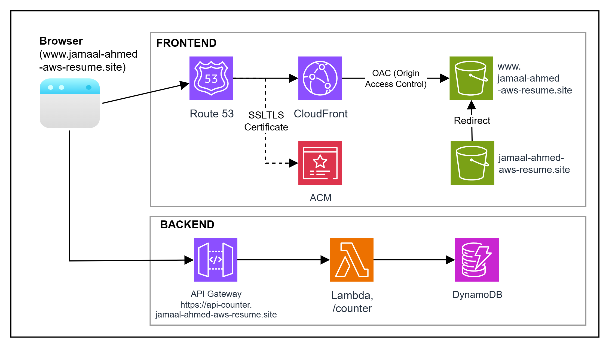
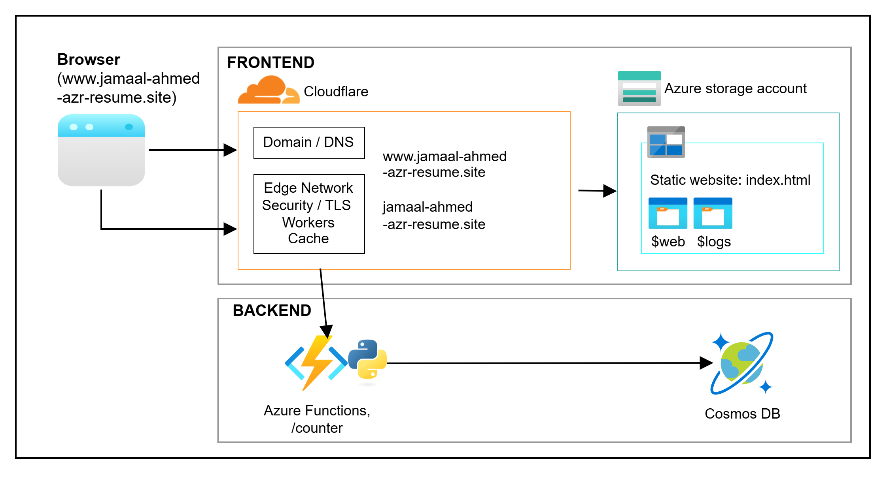
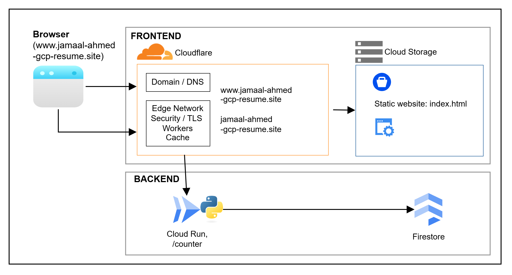

## Cloud Resume Challenge – Multi-Cloud Serverless Architecture

Production-style cloud-native resume application deployed across **Azure, AWS, and GCP**, demonstrating scalable backend APIs, infrastructure as code, and CI/CD pipelines.

### Architecture Overview

[AWS Architecture](./aws)  
  
&nbsp;&nbsp; Site: https://www.jamaal-ahmed-aws-resume.site

[Azure Architecture](./azure)  
  
&nbsp;&nbsp; Site: https://www.jamaal-ahmed-azr-resume.site

[GCP Architecture](./gcp)  
  
&nbsp;&nbsp; Site: https://www.jamaal-ahmed-gcp-resume.site

[Static site](./static-site) \
Starting point of the project

[Frontend (React Application)](./frontend) \
Converted from static site to react

[Back end counter (API Service)](./backend) \
Backend service for tracking and persisting page visit metrics, exposed via RESTful API and deployed using serverless/cloud-native infrastructure

### Key Features
- Serverless backend APIs (Azure Functions, AWS Lambda, GCP Cloud Run)
- Multi-cloud storage and database integration
- Infrastructure as Code (Bicep, Terraform, CloudFormation)
- CI/CD pipelines for automated deployment
- Secure API design with cloud-native services

### System Design Highlights
- Designed stateless serverless APIs for scalability and cost efficiency
- Implemented event-driven backend patterns across cloud providers
- Optimized for low-latency global delivery using CDN and edge services
- Structured infrastructure for portability across Azure, AWS, and GCP

### Key Learnings
- Designing scalable serverless APIs across multiple cloud providers
- Managing infrastructure using Infrastructure as Code
- Handling cross-cloud differences in services and deployment strategies
- Building reliable CI/CD pipelines for cloud-native applications
  
